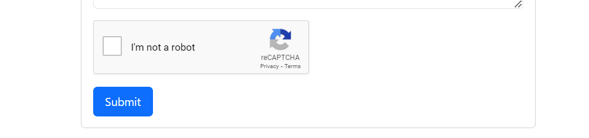

<p align="center"><a href="https://laravel.com" target="_blank"></a></p>

# laravel-10-captcha-3-recaptcha

Simple use of google recaptcha service in laravel project.



### Installation
1. unzip the project 
2. create a database named `laravel-10-captcha-recaptcha`
3. create credentials and update `.env` file (follow the step 3 in steps section)
4. navigate the project directory and run a command `composer install` to install all vendor packages
5. migrate the database run command `php artisan migrate`
6. start the server `php artisan serve`
7. visit to the url [http://localhost:8000](http://localhost:8000)

### Files in which i made changes
* routes\web.php
* app\Http\Controllers\TodoController.php
* .env
* config\recaptcha.php  (this file is created by command - not available by default - follow the steps)
* resources\views\todos.blade.php
* app\Models\Todo.php
* database\migrations\2024_07_10_084612_create_todos_table.php

## Steps

1. First i created a very simple todo project so i can implement the recaptcha on available form.   
   It has functionality to created, delete and view todos.

2. Install a package for recaptcha
    ```sh
    composer require biscolab/laravel-recaptcha
    ```
- Now you need to pubish the assets
    ```sh
    php artisan vendor:publish --provider="Biscolab\ReCaptcha\ReCaptchaServiceProvider"
    ```
- the above command will create the `config\recaptcha.php` file

3. After that you need to create credentials for recaptcha varification - follow the steps -
    - go to [https://www.google.com/recaptcha/admin/create](https://www.google.com/recaptcha/admin/create)
    - fill the details and click on submit
        * Label = appname
        * reCAPTCHA type = i choose version `v2` because it is default  
          Note : if your want to use `v3`, you need to change the version to `v3` in `config\recaptcha.php` file. It is by default `v2`
        * Domains = fill the domain (www.example.com). for me it is `localhost`. (No need to add `http://`, `https://`)
        * leave other fields unchanged
        * click on submit
    - On the next page it will show you both `SITE KEY` and `SECRET KEY`. Add those credentials on your `.env` file in next step 
    
4. in your `.env` file add two lines
    ```sh
    RECAPTCHA_SITE_KEY=*****************your_SITE_KEY***********************
    RECAPTCHA_SECRET_KEY=**********************your_SECRET_KEY**********************
    ```

5. change the error messasge in `config\recaptcha.php`<br>
    -----Default-----
    ```sh
    'error_message_key' => 'validation.recaptcha',  
    ```
    -----Updated-----
    ```sh
    'error_message_key' => 'Invalid ReCaptcha',   # add your custom message
    ```
    - Because you updated your configuration file you need to load it in cache by running the following command
    ```sh
    php artisan config:cache
    ```

6. You need to add the following line in the head section of your html page 
    ```php
    {!! htmlScriptTagJsApi() !!}
    ```
    Example : 
    ```html
    <head>
        <meta charset="UTF-8">
        <meta name="viewport" content="width=device-width, initial-scale=1.0">
        <meta http-equiv="X-UA-Compatible" content="ie=edge">
        <title>Recaptcha</title>
        <link href="https://cdn.jsdelivr.net/npm/bootstrap@5.3.3/dist/css/bootstrap.min.css" rel="stylesheet" integrity="sha384-QWTKZyjpPEjISv5WaRU9OFeRpok6YctnYmDr5pNlyT2bRjXh0JMhjY6hW+ALEwIH" crossorigin="anonymous">

        {!! htmlScriptTagJsApi() !!}
    </head>
    ```

7. Now add the following lines in your form - where you want to show your recaptcha
    ```sh
    {!! htmlFormSnippet() !!}
    @error('g-recaptcha-response')
        <small class="text-danger">{{ $error->first('g-recaptcha-response') }}</small>
    @enderror
    ```
    Example: 
    ```html
    <form action="{{ route('save.todo') }}" method="POST">
        @csrf
        {{-- Other input fields... --}}
        
        <div class="mb-3">
            {!! htmlFormSnippet() !!}
            @error('g-recaptcha-response')
                <small class="text-danger">{{ $error->first('g-recaptcha-response') }}</small>
            @enderror
        </div>
        <button type="submit" class="btn fs-6 btn-primary px-3 py-2">Submit</button>
    </form>
    ```

    - After that you will be able to see the captcha field : **Imp Note** = if you are using localhost and at the time of generating credentials you filled the `localhost` domain. <br> 
    Then you need to use `http://localhost:8000/` ---------- the IP will not work for you ----------

8. On the last step we need to some how validate the `g-recaptcha-response`
    - To do validation we can either create request or validate it in controller method. To make it simple let's use  controller method validation.

    - Under `app\Http\Controllers\TodoController.php` store function
    ```php
    public function store(Request $request){

        $validated = $request->validate([
            # other validations...
            'g-recaptcha-response' => 'recaptcha',        # added validation here
        ]);

        $todo = Todo::create($validated);
        return redirect('/')->with('success', 'created successfully!');
    }
    ```
9. Your recaptcha varification is completed. If any error happen on your side ask me in `issue` section


<br />
<p align="center">⭐️ Star my repositories if you find it helpful.</p>
